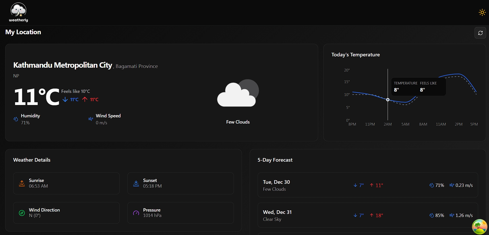

# Weatherly 

Weatherly is a simple and modern **weather app** built with **React, TypeScript, and Vite**.  
It allows you to check real-time weather conditions of any location with a clean and responsive interface.



## Features

- Get current weather by city name or geolocation.
- Displays temperature, weather conditions, and other details.
- Responsive design that works on desktop and mobile.
- Built with **React + TypeScript + Vite** for fast development and performance.

## Technologies Used

- **React** – UI library for building interactive components  
- **TypeScript** – Strongly-typed JavaScript for safer code  
- **Vite** – Fast build tool with hot module replacement  
- **Tailwind CSS / ShadCN UI** – Styling and UI components  

## Setup

1. Clone the repository:

```bash
git clone https://github.com/yourusername/weatherly.git
cd weatherly
